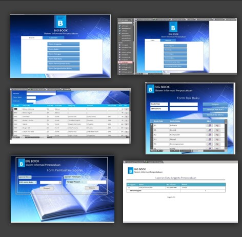
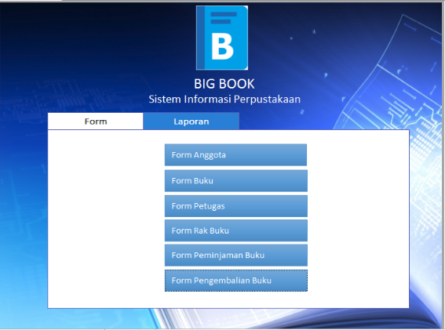
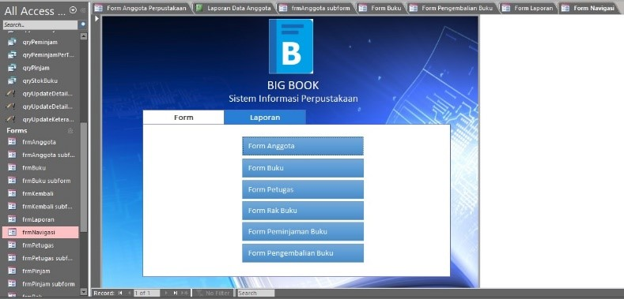
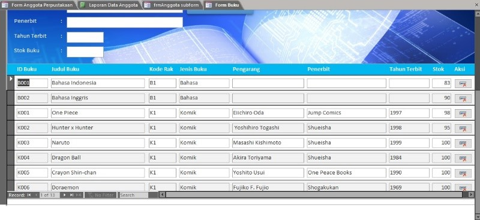
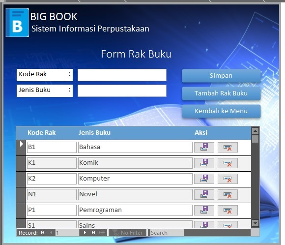
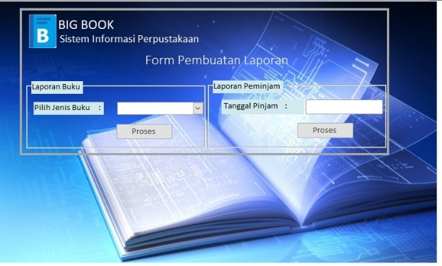
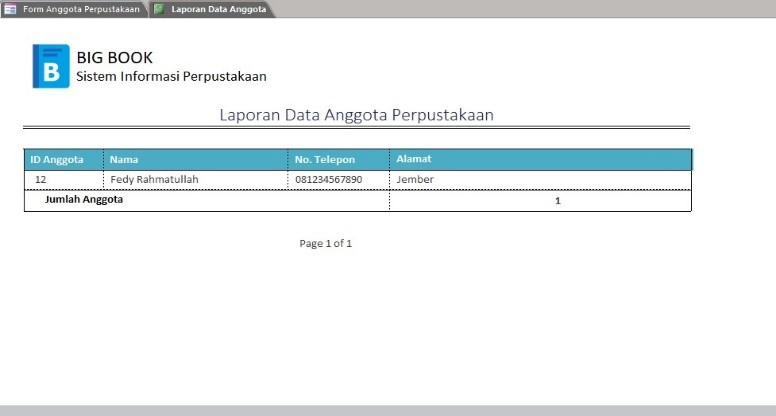

 

  <b><h1 align="center">Bigbook App</h1></b>

    <b><align="center">Sistem informasi Manajemen Perpustakaan</b>

 

  <a href="https://github.com/fedyrahmatullah/BigBook">Repository ini</a> adalah repository yang berisi Project sistem informasi manajemen perpustakaan yang dikembangkan menggunakan Microsoft Access, yaitu "Bigbook App".

  

Bigbook adalah aplikasi sistem informasi manajemen perpustakaan yang dikembangkan menggunakan microsoft access. Aplikasi ini mengolah manajemen data perpustakaan seperti data buku, anggota dan petugas perpustakaan, peminjaman dan pengembalian buku, dll.

 

 Berikut tampilan aplikasinya:  

 

  

 

  

 

  

 

  

 

  

 

  

 

 News About Bigbook:  

  

 

  

 

 How To Use:  

My First Project at College, develope library database using microsoft access  

You have to download the microsoft access project on that   
You have to make sure that you have microsoft access installed on your computer   
Opened the project and enjoyed it.
